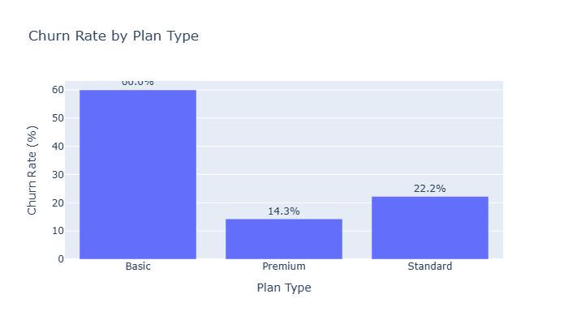
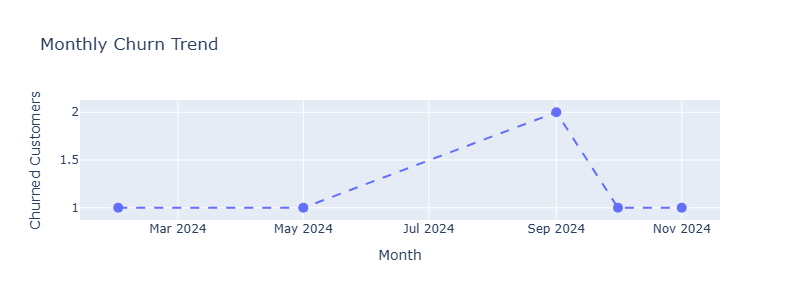
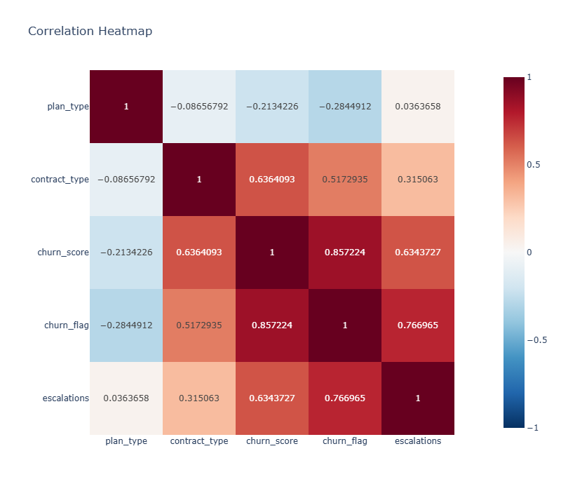

# 📊 Customer Churn Analysis


> A compact end-to-end data analytics project focused on customer churn, retention, subscription behavior, support interactions, and revenue at risk.

---

## 🎯 Project Overview

This project analyzes customer churn data stored across three SQLite tables:

- `db_customer` — customer profile information
- `db_subscription` — subscription, plan, contract, charges, CLTV and churn information
- `db_support` — complaint, escalation and CSAT information

The notebook demonstrates a practical analytics workflow:

**SQL extraction → data cleaning → data standardization → feature engineering → table merging → KPI analysis → visualization → correlation analysis → pivot tables**

---

## 📌 Key Business Metrics

| KPI | Result |
|---|---:|
| **Customers analyzed** | 21 |
| **Churn rate** | **28.57%** |
| **Retention rate** | **71.43%** |
| **ARPU / average monthly charge** | **₹18.85** |
| **Revenue at risk from churned users** | **₹73.94K** |
| **Escalation rate** | **19.05%** |
| **Average complaints per user** | **0.43** |
| **Escalation ↔ churn correlation** | **0.77** |
| **Average tenure** | **1,539 days** |

> Revenue-at-risk follows the notebook's reported unit: **Rs 'K'**.

---

## 🔎 Major Findings

### 1. Basic plan has the highest churn

| Plan | Churn Rate |
|---|---:|
| **Basic** | **60.00%** |
| Standard | 22.22% |
| Premium | 14.29% |

The Basic segment is the clearest retention-risk group in this sample.

### 2. Escalations are strongly associated with churn

The notebook reports a **0.77 correlation** between escalation and churn flag. This is a strong positive relationship in the analyzed sample and suggests that escalated support interactions deserve attention in churn-monitoring workflows.

**Important:** correlation does not establish causation.

### 3. Referral customers show elevated churn

The notebook reports:

| Subscription Type | Churn Rate |
|---|---:|
| Organic | 0.00% |
| Paid | 16.67% |
| **Refferal** | **83.33%** |

`Refferal` is the spelling used in the source data.

### 4. State-level churn is uneven

The highest reported state-level churn rates are:

- **Karnataka — 100.00%**
- **Meghalaya — 66.67%**
- **Telangana — 50.00%**
- **Delhi — 25.00%**

These percentages are based on small customer counts, so they should be treated as directional rather than definitive.

---

## 📈 Visual Analysis

### Churn Rate by Plan Type



### Monthly Churn Trend



### Correlation Heatmap



---

## 🧹 Data Preparation

The notebook performs the following cleaning steps:

1. Renames `name` to `customer_name`.
2. Removes `interests` and `pincode` from the customer table.
3. Converts date fields to datetime.
4. Standardizes gender values:
   - `Men` → `Male`
   - `Women` → `Female`
5. Fills missing customer country values using the state-to-country mapping available in the data.
6. Creates `churn_flag` from `cancellation_date`.
7. Removes unused support columns `col_1` and `comment`.
8. Calculates `complaint_count` by customer.
9. Sorts support records by complaint date and keeps the latest record per customer before merging.
10. Merges customer, subscription and support data into a final analytical dataset of **21 rows**.

---

## 🧮 Feature Engineering

The analysis creates several useful analytical fields:

- `churn_flag`
- `complaint_count`
- `customer_age`
- `tenure_days`
- `cancellation_month`

These features support churn KPIs, segmentation, trend analysis and correlation analysis.

---

## 🛠️ Technical Stack

| Tool | Purpose |
|---|---|
| **Python** | Analysis workflow |
| **Pandas** | Data manipulation |
| **NumPy** | Numerical transformations |
| **SQLite / SQL** | Data extraction and aggregation |
| **Matplotlib** | Visualization |
| **Seaborn** | Statistical visualization |
| **Plotly Express** | Interactive charts |
| **Google Colab** | Notebook execution environment |

---

## 🧠 Analytical Workflow

```text
SQLite Database
      │
      ├── db_customer
      ├── db_subscription
      └── db_support
              │
              ▼
        Data Cleaning
              │
              ▼
      Feature Engineering
              │
              ▼
        Table Merging
              │
              ▼
        KPI Calculation
              │
              ├── Churn Rate
              ├── Retention Rate
              ├── ARPU
              ├── Revenue at Risk
              ├── Escalation Rate
              └── Complaint Metrics
              │
              ▼
       Exploratory Analysis
              │
              ├── Plan-level churn
              ├── State-level churn
              ├── Subscription-type churn
              ├── Monthly churn
              └── Correlations
              │
              ▼
       Business Insights
```

---

## 💡 Recommended Business Actions

### Priority 1 — Investigate Basic-plan churn
The Basic plan has a 60% churn rate in the sample. Review pricing, perceived value, onboarding and cancellation reasons for this segment.

### Priority 2 — Monitor escalated support cases
Because escalation and churn have a reported 0.77 correlation, escalated cases can be incorporated into a retention-risk monitoring process.

### Priority 3 — Audit referral acquisition quality
The source data shows 83.33% churn for `Refferal` customers. Validate this result with a larger sample before changing acquisition strategy.

### Priority 4 — Segment retention programs
Combine plan type, contract type, churn score, support history and customer value to prioritize customers for intervention.

---

## ⚠️ Data & Methodology Notes

- The analysis contains only **21 customers**, so percentages can move substantially with one or two customers.
- State-level results with very small customer counts should not be generalized.
- The correlation between escalation and churn is **associational**, not causal.
- The notebook uses ordered numeric encodings for `plan_type` and `contract_type` in the final correlation matrix. Correlations involving encoded categorical variables should therefore be interpreted cautiously.
- Customer age is calculated using the current year in the notebook, rather than an exact birthday-adjusted age.
- The support table initially contains multiple records for some customers; the notebook creates `complaint_count`, then retains the latest support record per customer for the final merge.
- The notebook also contains a small standalone SQLite practice section (`users` table). That section is separate from the customer churn analysis.

---

## 📂 Suggested Repository Structure

```text
churn-analysis/
├── Churn_Analysis
├── README.md
├── churn_analysis_report.pdf
└── assets/
    ├── correlation_heatmap.png
    ├── churn_rate_by_plan.png
    └── monthly_churn_trend.png
```

---

## 👤 Analyst Takeaway

The strongest signal in this dataset is that **churn is concentrated in specific customer segments rather than being evenly distributed**. The Basic plan and referral acquisition channel stand out, while escalated support interactions show a strong positive association with churn.

The next analytical step should be to validate these patterns on a larger dataset and build a customer-level churn-risk segmentation that combines **churn score, plan, contract, support activity, tenure and customer value**.

---

*Prepared from the supplied `Churn_Analysis` notebook and its reported outputs.*
